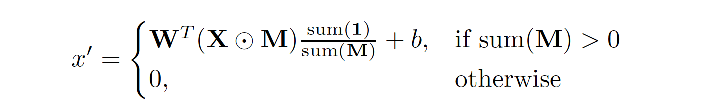
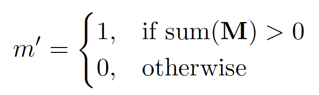
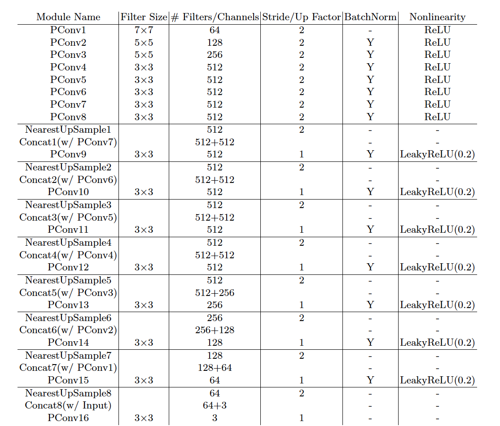
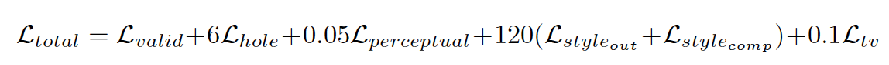
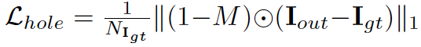
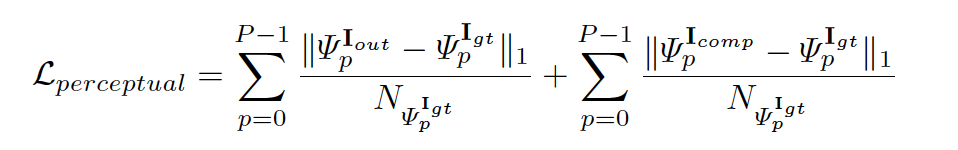
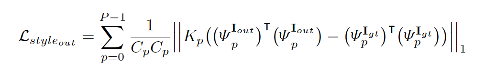
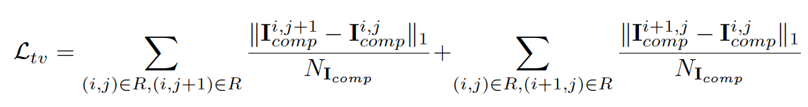

# Image Inpainting for Irregular Holes Using Partial Convolutions  

abstract  
--------  
기존에는 표준적인 convolutional network : 색깔 차이를 보이거나 흐릿하다는 문제점  
-> partial convolutions : convolution이 유효한 픽셀에 대해서'만' masked, renormalized되는 방식  

Introduction & Related work    
-------- 
Goal : irregular hole pattern에도 이미지 복원을 견고하게 잘 해내는 모델을 제안하고,  
따로 후처리가 필요없이 이미지가 자연스럽게 보여지도록 예측을 잘 해내는 것이다.  

## 최근 image inpainting 접근법 및 문제점   
__1) Non-learning Based model__ : use image statistics  
problems     
- 구멍을 채우기 위해서 통계적인 방법을 사용  
- 시각적으로 의미를 지니지 않는 결과  
- 작은 구멍에 대해서만 성능이 잘 나타남(==variance is low)  
- large computation cost  

__2) Deep learning Based model__ : use deeplearning  
이미지에 convolutional filters를 적용하고 구멍은 고정된 초기값을 채워넣는다.  
problems      
- 구멍을 어떻게 초기화하느냐에 따라 결과가 다르게 나타남.  
- post-processing을 필요로 하는 방식.  

__3) focus on rectangular shaped holes__    
problems      
limit the utility of these models in application  
  
__-> 이 논문에서는 구멍 초기화에 상관없이 이미지 복원을 잘하고, irregular hole에 잘 대응할 수 있도록 큰 이미지 벤치마크를 사용했으며    
비싼 post processing을 필요로 하지 않는 방법을 모색하고자 함.__    

Approach  
------  
__1. Partial Convolutional Layer__    
partial convolution은 다음과 같이 연산한다:  
</img>

W : convolution filter weights  
b : bias  
X : feature values for the current convolution window(input으로 들어오는 feature)  
M : binary mask(input으로 들어오는 Mask)     

각 partial convolution 연산 이후에는, 마스크를 다음과 같이 업데이트 한다:  
</img>  
0 -> 구멍 포함  
1 -> 구멍 포함 안함  

__2. Network Architecture and Implementation__   
</img>  
image/mask 사이즈 : CxHxW  
UNet-like architecture 사용 : partial convolutional 레이어들 + nearest neighbor up-sampling  
마지막 partial convolutional 레이어의 인풋 : 구멍을 포함한 원본 이미지 + 원본 마스크 -> 아웃풋 이미지에 인풋 이미지 정보를 전달하기 위함.  

__3. Loss Functions__    
아래의 전체 Loss는 각종 Loss들이 조합이다.  
</img>  
1) hole loss : hole인 부분에 대한 loss   
</img>  
2) valid loss : non hole인 부분에 대한 loss  
</img>  
3) perceptual loss : I out과 I comp 픽셀간의 차이를 줄이기 위함.  
I out : 모델을 타고 나오는 결과 이미지  
I comp : I out에서 non-hole부분을 원래 input pixel값으로 바꾼 것  
</img>  
4),5) L style loss
</img>  
</img>  
6) total variation loss : hole의 경계에 대한 loss  
</img>  

Experiments  
-----  
1. 

