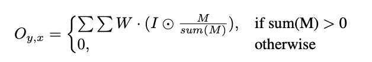
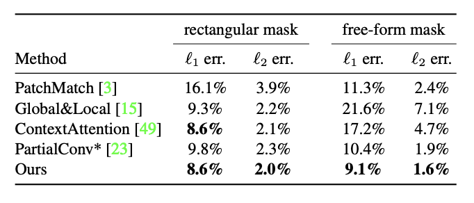
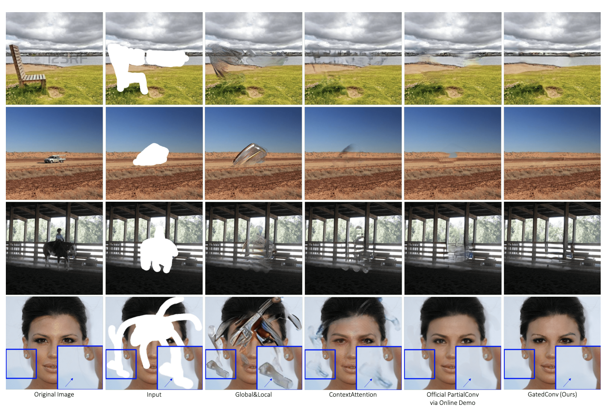
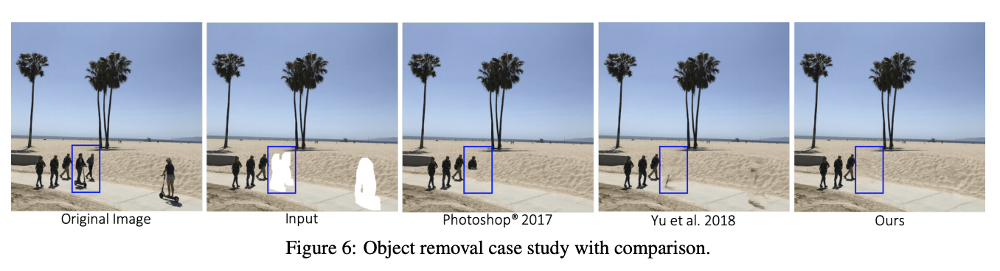

# Free-Form Image Inpainting with Gated Convolution

## A**bstract**

As free-form masks may appear anywhere in images with any shape, global and local GANs
designed for a single rectangular mask are not applicable.

→ It presents a patch-based GAN loss, named SNPatchGAN and helps user quickly remove distracting objects, modify image layouts, clear watermarks and edit faces. 

## **Introduction**

1. It introduces gated convolution to learn a dynamic feature selection mechanism for each channel at each spatial location across all layers.
2. It presents a more practical patch-based GAN discriminator,SNPatchGAN, for free-form image inpainting.
3. It extends its inpainting model to an interactive one, enabling user sketch as guidance to obtain more user-desired inpainting results. 
4. Its proposed inpainting system achieves higher-quality free-form inpainting than previous state of the arts on benchmark datasets including Places2 natural scenes and CelebA-HQ faces. 

## **Approach**

1. Gated Convolution

     Recently partial convolution is proposed which adapts a masking and re-normalization step to make the convolution dependent only on valid pixels as like below.

    
     </img>  

    in which M is the corresponding binary mask, 1 represents pixel in the location(y, x) is valid, 0 represents the pixel is invalid, circle denotes element-wise multiplication.

2. SN-PatchGAN

    It adapts the recently proposed spectral normalization to further stabilize the training of GANS. It uses the default fast approximation algorithm of spectral normalization described in SN-GANS. With SN-PatchGAN, its inpainting network trains faster and more stable than baseline model.

3. Inpainting Network Architecture

    It replaces all vanilla convolutions with gated convolutions.

4. Free-Form Mask Generation

    The algorithm to automatically generate free-form masks is important and non-trivial. The sampled masks, in essence, should be (1) similar to masks drawn in real use-cases, (2) diverse to avoid over-fitting, (3) efficient in computation and storage, (4) controllable and flexible.

5. Extension to User-Guided Image Inpainting

    It uses sketch as an example user guidance to extend its image inpainting network as a user-guided system. For training the user-guided image inpainting system, intuitively it will need additional constraint loss to enforce the network generating results conditioned on the user guidance. 

## Results

It evalutates the proposed free-form image inpainting system on Places2 and CelebA-HQ faces.

1. Quantitative Results

     </img>  

2. Qualitative Comparisons

     </img>  

3. Object Removal and Creative Editing

     </img>  
     
## Conclusions

1. A novel free-form image inpainting system : based on an end-to-end generative network with gated convolution.
2. User sketch as an exemplar guidance to help users quickly remove distracting objects, modify image layouts, clear watermarks, etc.

## References

Jiahui Yi. Free-Form Image Inpainting with Gated Convolution
