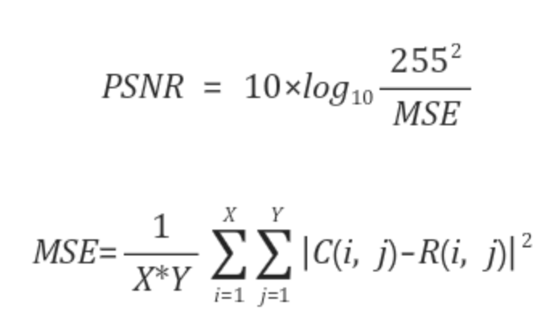
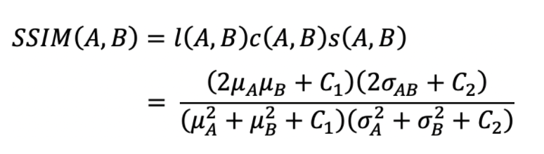
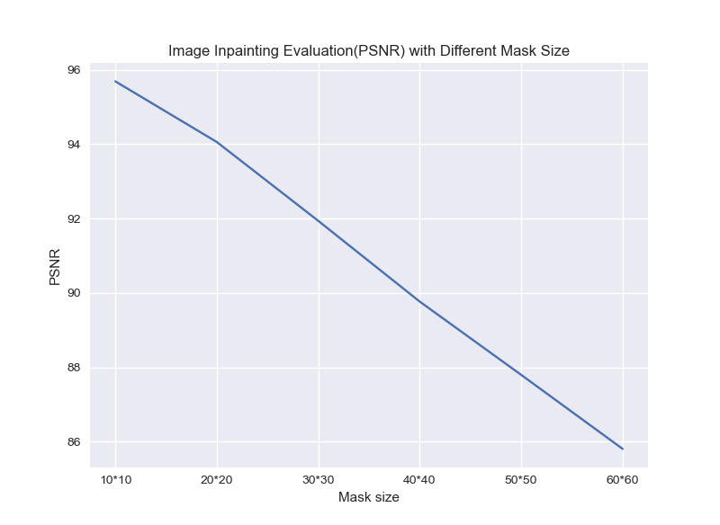
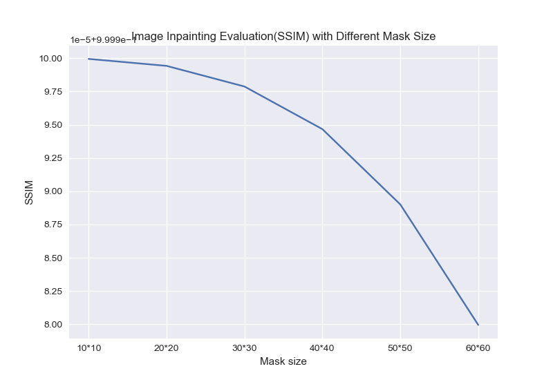

# 졸업 프로젝트  
```
진행 학기 : 4학년 1,2학기 (2020.03 - 2020.11)  
참가 인원 : 2인1팀  
지도 교수님 : 김태현 교수님  
졸업 프로젝트 주제 : image inpainting    
목표 : image inpainting에서 사용된 딥러닝 방식을 이해하고 응용해보기   
```
### Basics : 주제에 대한 간략한 설명   

`Image inpainting 이란?` : 이미지에서 노이즈나 지워진 부분을 복원하는 것   

초기에 사용하는 방법 : 주변 픽셀 값을 이용하여 비어있는 값을 예측하여 채우는 방식([참고](https://docs.opencv.org/master/df/d3d/tutorial_py_inpainting.html))    
최근에 사용하는 방법 : 딥러닝을 이용한 방식으로 CNN과 같은 특정 네트워크를 이용하여 학습시킨 모델을 이용  

### Process     
  1. Paper review    
1)`Generative Image Inpainting with Contextual Attention 21 Mar 2018` | 
[논문](https://arxiv.org/pdf/1801.07892.pdf) | 
[코드](https://github.com/JiahuiYu/generative_inpainting) | 
[리뷰](https://github.com/stellakang/vision_proj/blob/master/GenerativeImageInpaintingWithContextualAttention.md)  
2)`Image Inpainting for Irregular Holes Using Partial Convolutions 15 Dec 2018` | 
[논문](https://arxiv.org/abs/1804.07723) | 
[코드](https://github.com/MathiasGruber/PConv-Keras/blob/master/libs/pconv_model.py) | 
[리뷰](https://github.com/kangsj123/vision_proj/blob/master/ForIrregularHolesUsingPartialConvolutions.md)   
3)`Free-Form Image Inpainting with Gated Convolution 22 Oct 2019` | 
[논문](https://arxiv.org/pdf/1806.03589.pdf) | 
[코드](https://github.com/JiahuiYu/generative_inpainting) | 
[리뷰]() |   

  2. Small tasks   
  `목표` | 어떤 요소들이 image inpainting의 성능에 영향을 끼칠 것인지 생각해보기 & 결과 분석하는 자동화된 코드 작성 및 결과 측정      
  `사용한 모델의 논문` | Generative Image Inpainting with Contextual Attention [링크](https://arxiv.org/pdf/1801.07892.pdf)    
  `metrics`  
  - psnr  
      
    원본 이미지와 데이터 손실이 있는 이미지 간의 화질 차이를 측정하기 위함.  
    MSE는 원본 이미지와 데이터의 손실이 있는 이미지간의 픽셀 대 픽셀 차이값의 제곱합을 평균낸 값  

  - ssim   
      
    수치적인 에러가 아닌 인간의 시각적 화질 차이 및 유사도를 평가하기 위해 고안된 방법  
    두 이미지의 휘도, 대비, 및 구조를 비교  

     2-1. mask size에 따른 성능 평가 | [작성 코드](https://github.com/stellakang/vision_proj/blob/master/evaluation/mask-size)    
     
     - mask의 size에 따라 이미지 복원 정도가 달라질 것.   
     - 사용한 데이터셋 : [places2](http://places2.csail.mit.edu/download.html) -> 링크의 places365-standard의 high resolution images의 test images      
     - places2 dataset으로 pretrained된 모델을 이용  
     - 1)places2 dataset의 이미지와 2)가운데에 직사각형으로 위치한 mask 파일을 이용하여 prediction 시킨 결과를 얻는다.   
     - 방법    
       1) [논문 레포](https://github.com/JiahuiYu/generative_inpainting)를 다운받고(clone) `Run`에 나와있는 환경 설정 및 pretrained model 다운로드   
       2) [generate.yml](https://github.com/stellakang/vision_proj/blob/master/evaluation/mask-size/generate.yml)에 정보 기입   
         - `sample_set_directory`: test dataset의 path (ex. "examples/test_large")   
         - `test_set_directory`: prediction을 진행할 위치 & 이미지 복원 결과로 나온 이미지를 저장. 경로 생성하므로 경로 존재하지 않아도 됨. (ex. "examples/test_places2")  
         - `masksize_options`: 가운데에 위치할 마스크의 `height*width` 정보 (ex. `["10*10", "20*20", "30*30"]`)   
         - `model_directory`: train된 모델의 path (ex. "model_logs/release_places2_256")    
       3) 1)에서 다운받은 레포 내에 `generate.yml`, `test_mask_size.py`를 위치시킨다.  
       4) `python test_mask_size.py`를 실행한다.  

     2-2. mask의 위치에 따른 성능 평가 | [작성 코드](https://github.com/stellakang/vision_proj/blob/master/evaluation/mask-position)   
     
     - mask가 픽셀값의 변화가 큰 조각상 위에 위치하는지, 하늘과 같이 픽셀값의 변화가 작은 곳에 위치하느냐에 따라 이미지 복원 정도가 달라질 것.  
     - 사용한 데이터셋 : [places2](http://places2.csail.mit.edu/download.html)   
     - places2 dataset으로 pretrained된 모델을 이용  
     - segmentation map을 이용하여 물체를 구분하여 mask의 위치를 다르게 함.   
     - 방법  
       1) [논문 레포](https://github.com/JiahuiYu/generative_inpainting)를 다운받고(clone) `Run`에 나와있는 환경 설정 및 pretrained model 다운로드   
  
  3. Future tasks  
  

### Result  

1. 요약    

2. Small tasks  

  2-1. mask size에 따른 성능 평가  
  
  1)PSNR  
    
  | | 10x10 | 20x20 | 30x30 | 40x40 | 50x50 | 60x60 |   
|:---:|:---:| :---: | :---: |:---:|:---:|:---:|  
| PSNR | 95.69 | 94.06 | 91.94 | 89.77	| 87.80 | 85.81 |  

  
  2)SSIM  
    
  | | 10x10 | 20x20 | 30x30 | 40x40 | 50x50 | 60x60 |   
|:---:|:---:| :---: | :---: |:---:|:---:|:---:|  
| SSIM | 0.999999951504037 | 0.9999994279626380 | 0.999997875733462 | 0.999994670819185	| 0.999989010766895 | 0.999979951577578 |   
  
  2-2. mask 위치에 따른 성능 평가  

3. Future tasks   


